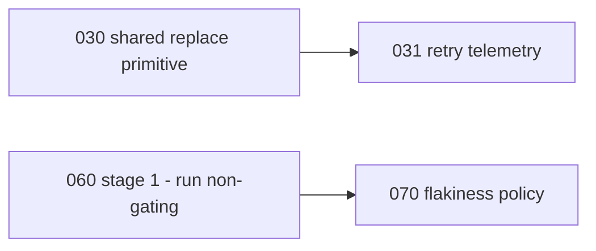

# 002 — Sequencing and what this unit deliberately does not do

The first draft of this document claimed a long dependency chain. A plan audit
(round `r1-20260817113441`) showed most of it was file-overlap dressed up as
dependency, and one link was backwards. This is the corrected version; the
reasoning is kept because "why we thought these were dependencies" is the more
useful record.

## Real dependencies

Only two links are structural:

`030 → 031` because there is nothing to instrument until the primitive exists.
`060 stage 1 → 070` because the flakiness policy is calibrated on the failure
data stage 1 produces.

Everything else is schedulable now.

## Start immediately, in parallel

- **060 stage 1** — highest priority despite its number. It only makes Windows
  *run*; it blocks nothing, and every later phase wants its data. Its one
  prerequisite is the runner-policy decision inside 060, which is a decision to
  make rather than work to schedule.
- **010** — one line plus a widened guard.
- **051** — crash-restart already exists, so it is testable today. Landing it
  before 050 gives the timing change a baseline.
- **040** — independent inventory, produces a document.

## Ordering preferences that are not dependencies

Stated so nobody mistakes them for blockers:

- **010 before 020** was originally justified as "otherwise the fix is written
  twice". That is wrong: deduplicating first moves one flawed implementation,
  and 010 then fixes it once. Either order works. Prefer 010 first only because
  it is trivial and unblocks nothing else.
- **020 before 030** is people-not-colliding in `service.ts` and `job.ts`.
- **010/020 before 050** is the same, all three touch `src/service.ts`.
- **050 before 051** was fake, and worse, it produced an impossible verification
  claim — 051 now says plainly that it cannot verify 050's backoff.
- **"everything before 060"** was false. None of F1, F2, F4, F5 or F6 makes the
  suite red today. What is true is narrower: **060 stages 3 and 4** should wait
  for the fixes, because that is when a Windows failure starts costing someone
  a merge or a release.
- **080** is simplest to add once 060 stage 1 has a Windows leg running, but it
  is not blocked by it; it starts non-gating and does not wait for stage 3.

Each phase header states its own dependency line. Where a header says "sequence
around" another phase, that is collision avoidance in shared files — `002` is
authoritative on what is structural, and only the two links above are.

## Out of scope for this unit

**The synchronous-subprocess latency class.** Both P1 and P3 rank
`icacls`/PowerShell-CIM on the request path as the top runtime problem
(#1852, #1298, PR #1876). It is excluded because this session measured nothing —
no latency numbers, no event-loop traces. Carrying it would put an unverified
claim beside seven verified ones and devalue all of them.

The audit accepted that exclusion as honest and then made the sharper point:
because `000` itself names this the leading runtime class, finishing this unit
**cannot** establish "Windows is stable". It establishes a reliability and CI
baseline while the highest-ranked risk stays open in #1876. That is the accurate
claim and the one to make in any release note.

**Update transactionality.** #1849 is open and the design work — stage outside
the live tree, verify, switch, retire the backup — is larger than any phase
here. Separate unit.

**Branch protection.** 060 cannot make Windows block a merge; `dev` has no
protection and `MAINTAINERS.md:121` and `:125` record that enforcing anything
that way is an unmade decision. Configuring it is a maintainer call, not a
phase.

## Definition of done for the unit

- 010, 020, 030, 031, 050, 051 landed, each guard driven red before it counts.
- 060 through stage 4, so a release preflight cannot pass on a push run where
  Windows silently skipped.
- 060's runner policy explicitly resolved rather than left implicit.
- 070's nightly running, quarantine list open and reviewed each release.
- 080 items 1-5 landed; items 6 and 7 landed or documented as not achievable.
- 040's inventory complete, with any live exposure handled entirely in scratch
  per AGENTS.md and nothing about it written here.

Until 060 stage 4 is done, every fix in this unit is one careless merge from
regressing. That is the point of the unit.
